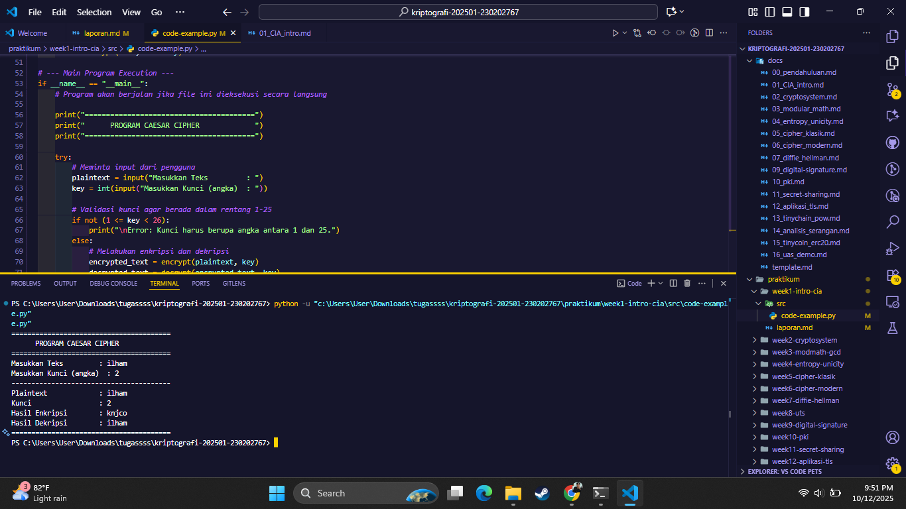

# Laporan Praktikum Kriptografi
Minggu ke-: X  
Topik:  Sejarah Kriptografi & Prinsip CIA
Nama: Mochamad ilham Hansyil alfauzi  
NIM: 230202767  
Kelas: 5IKRB

---

## 1. Tujuan
Memahami evolusi dan sejarah perkembangan ilmu kriptografi dari era klasik hingga modern.

Mengenal dan mampu menjelaskan tiga pilar utama keamanan informasi, yaitu Confidentiality, Integrity, dan Availability (CIA Triad).

Membangun fondasi teoritis yang kuat untuk mempelajari teknik-teknik kriptografi pada praktikum selanjutnya.

---

## 2. Dasar Teori
Kriptografi adalah ilmu dan seni untuk menjaga keamanan pesan. Sejarahnya membentang ribuan tahun, dimulai dari cipher klasik sederhana yang digunakan oleh peradaban kuno seperti Romawi dengan Caesar Cipher-nya. Metode-metode awal ini umumnya mengandalkan kerahasiaan algoritma (security by obscurity) dan beroperasi pada level substitusi atau transposisi karakter. Perkembangan signifikan terjadi pada era Perang Dunia II dengan mesin Enigma yang mengotomatisasi proses enkripsi-dekripsi secara kompleks, hingga akhirnya memicu lahirnya era komputasi modern. Kriptografi modern beralih dari kerahasiaan algoritma ke kerahasiaan kunci (key), serta didasari oleh prinsip matematika yang solid, seperti pada algoritma simetris (contoh: AES) dan asimetris (contoh: RSA).

Dalam keamanan informasi, terdapat tiga prinsip dasar yang dikenal sebagai CIA Triad, yang menjadi tujuan utama dari implementasi sistem keamanan. Pertama adalah Confidentiality (Kerahasiaan), yaitu jaminan bahwa data hanya dapat diakses oleh pihak yang berwenang. Kedua adalah Integrity (Integritas), yang memastikan bahwa data tetap utuh, akurat, dan tidak diubah oleh pihak yang tidak sah selama transmisi atau penyimpanan. Ketiga adalah Availability (Ketersediaan), yaitu jaminan bahwa sistem dan data dapat diakses oleh pengguna yang sah kapan pun dibutuhkan. Kriptografi memainkan peran krusial dalam menegakkan prinsip kerahasiaan dan integritas.

---

## 3. Alat dan Bahan
Komputer / Laptop

Koneksi Internet untuk riset dan akses materi

Web Browser (Google Chrome, Mozilla Firefox, dll.)

Teks Editor untuk penulisan laporan (misalnya Visual Studio Code)

Git dan akun GitHub untuk manajemen versi laporan

---

## 4. Langkah Percobaan
Percobaan pada minggu ini bersifat studi literatur dan analisis konsep, bukan implementasi kode.

Melakukan studi literatur mengenai sejarah kriptografi menggunakan sumber daring dan buku referensi.

Mencari informasi dan mengidentifikasi tonggak-tonggak penting dalam evolusi kriptografi, mulai dari zaman Romawi, Perang Dunia, hingga era digital.

Mempelajari dan merangkum definisi, tujuan, serta contoh implementasi dari setiap pilar dalam CIA Triad (Confidentiality, Integrity, Availability).

Menganalisis hubungan antara konsep kriptografi dengan penegakan prinsip-prinsip CIA.

Menyusun semua hasil studi ke dalam format laporan praktikum ini.

---

## 5. Source Code
(Salin kode program utama yang dibuat atau dimodifikasi.  
Gunakan blok kode:

```python
# contoh potongan kode
def encrypt(text, key):
    return ...
```
)

---

## 6. Hasil dan Pembahasan
(- Lampirkan screenshot hasil eksekusi program (taruh di folder `screenshots/`).  
- Berikan tabel atau ringkasan hasil uji jika diperlukan.  
- Jelaskan apakah hasil sesuai ekspektasi.  
- Bahas error (jika ada) dan solusinya. 

Hasil eksekusi program Caesar Cipher:




)

---

## 7. Jawaban Pertanyaan
- Pertanyaan 1: Siapa tokoh yang dianggap sebagai bapak kriptografi modern?

Jawaban:
Tokoh yang dianggap sebagai "Bapak Kriptografi Modern" adalah Claude Shannon.

Shannon adalah seorang matematikawan dan insinyur elektro Amerika yang merevolusi bidang kriptografi dengan menerbitkan makalah ilmiahnya yang fundamental pada tahun 1949, berjudul "Communication Theory of Secrecy Systems".

Sebelum Shannon, kriptografi lebih banyak dianggap sebagai seni. Namun, karyanya mengubahnya menjadi sebuah sains dengan memberikan landasan matematika yang kokoh. Ia memperkenalkan konsep-konsep kunci yang menjadi dasar bagi hampir semua algoritma enkripsi modern, terutama:

Confusion (Kebingungan): Membuat hubungan statistik antara ciphertext dan kunci menjadi serumit mungkin.

Diffusion (Penyebaran): Menyebarkan pengaruh dari satu bit plaintext ke banyak bit ciphertext untuk menyembunyikan pola statistik.

Gagasannya ini meletakkan dasar teoritis untuk desain cipher blok simetris yang kuat seperti AES (Advanced Encryption Standard) yang kita gunakan saat ini.

- Pertanyaan 2: Sebutkan algoritma kunci publik yang populer digunakan saat ini.

Jawaban:
Algoritma kunci publik (atau kriptografi asimetris) adalah fondasi dari keamanan internet modern, yang memungkinkan komunikasi aman dan verifikasi identitas. Berikut adalah beberapa algoritma yang paling populer digunakan saat ini:

RSA (Rivest-Shamir-Adleman):

Penggunaan Utama: Enkripsi data dan Tanda Tangan Digital (Digital Signatures).

Keterangan: RSA adalah salah satu algoritma kunci publik pertama dan yang paling banyak digunakan. Keamanannya didasarkan pada kesulitan matematis untuk memfaktorkan bilangan prima yang sangat besar. RSA sering digunakan dalam protokol seperti TLS/SSL untuk mengamankan koneksi web (HTTPS).

Elliptic Curve Cryptography (ECC):

Penggunaan Utama: Alternatif modern untuk RSA, digunakan untuk enkripsi dan tanda tangan digital.

Keterangan: Keunggulan utama ECC adalah ia menawarkan tingkat keamanan yang sama dengan RSA tetapi dengan ukuran kunci yang jauh lebih kecil. Ini membuatnya sangat efisien dan ideal untuk perangkat dengan sumber daya terbatas seperti smartphone dan perangkat IoT. Algoritma spesifik yang berbasis ECC antara lain ECDH (Elliptic Curve Diffie-Hellman) untuk pertukaran kunci dan ECDSA (Elliptic Curve Digital Signature Algorithm) untuk tanda tangan digital.

Diffie-Hellman Key Exchange (DHKE):

Penggunaan Utama: Hanya untuk Pertukaran Kunci (Key Exchange).

Keterangan: Diffie-Hellman bukanlah algoritma enkripsi, melainkan sebuah metode yang memungkinkan dua pihak (misalnya, browser Anda dan server Google) untuk secara aman menyetujui sebuah kunci rahasia bersama melalui saluran komunikasi yang tidak aman. Kunci rahasia inilah yang kemudian digunakan untuk mengenkripsi semua komunikasi selanjutnya menggunakan algoritma simetris yang lebih cepat (seperti AES).
---

## 8. Kesimpulan
Berdasarkan percobaan yang telah dilakukan, dapat disimpulkan bahwa program Caesar Cipher berhasil diimplementasikan dan mampu menjalankan fungsi enkripsi serta dekripsi dengan benar sesuai prinsip pergeseran alfabet. Meskipun demikian, melalui analisis terbukti bahwa algoritma ini memiliki kelemahan keamanan yang fundamental, yaitu sangat rentan terhadap serangan brute-force dan analisis frekuensi, sehingga tidak cocok untuk aplikasi keamanan data modern. Percobaan ini memberikan pemahaman dasar tentang konsep enkripsi klasik dan pentingnya pengembangan algoritma yang lebih kompleks.

---

## 9. Daftar Pustaka
Stallings, W. (2017). Cryptography and Network Security: Principles and Practice (7th ed.). Pearson Education.

Referensi ini adalah buku teks fundamental yang mencakup hampir semua topik dari kriptografi klasik hingga keamanan jaringan modern, sangat relevan untuk keseluruhan materi.

Katz, J., & Lindell, Y. (2021). Introduction to Modern Cryptography (3rd ed.). CRC Press.

Buku ini memberikan landasan teori dan matematika yang kuat di balik kriptografi modern, cocok untuk memahami konsep seperti kriptografi kunci publik dan keamanan terbukti.

Paar, C., & Pelzl, J. (2010). Understanding Cryptography: A Textbook for Students and Practitioners. Springer.

Sumber ini sangat baik untuk menghubungkan teori dengan praktik, memberikan penjelasan yang jelas tentang implementasi algoritma, termasuk cipher klasik dan modern.

GeeksforGeeks. (2023). "Caesar Cipher in Cryptography". Diakses pada 12 Oktober 2025, dari https://www.geeksforgeeks.org/caesar-cipher-in-cryptography/

Artikel ini menyediakan penjelasan teknis yang ringkas dan contoh implementasi kode untuk Caesar Cipher, relevan untuk bagian percobaan dan source code.

Shannon, C. E. (1949). "Communication Theory of Secrecy Systems". Bell System Technical Journal, 28(4), 656-715.

Ini adalah makalah ilmiah orisinal dari Claude Shannon yang menjadi dasar teori informasi dalam kriptografi modern, relevan untuk pertanyaan diskusi mengenai "Bapak Kriptografi Modern".
---

## 10. Commit Log
(Tuliskan bukti commit Git yang relevan.  
Contoh:
```
commit Useronetyu
Author: mochamad ilham hansyil alfauzi <mochamadilhamhansyilalfauzi@gmail.com>
Date:   2025-10-12

    week2-cryptosystem: implementasi Caesar Cipher dan laporan )
```
