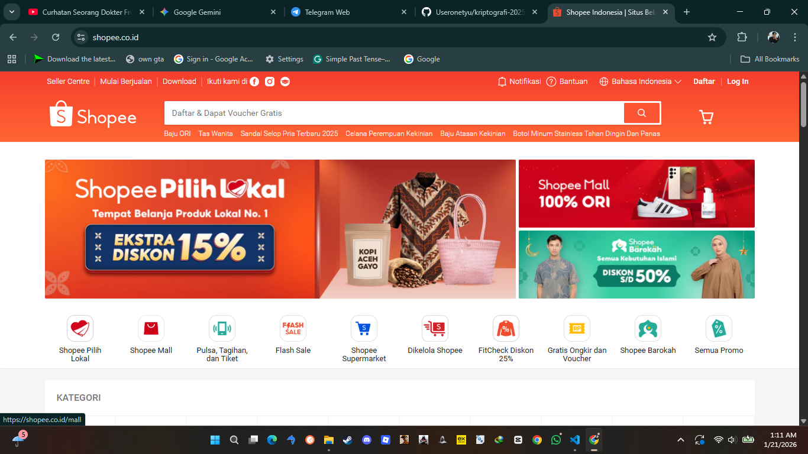

# Laporan Praktikum Kriptografi
**Minggu ke-:** 12  
**Topik:** Aplikasi TLS & E-commerce  
**Nama:** Mochamad Ilham Hansyil Alfauzi  
**NIM:** 2320202767  
**Kelas:** 5IKRB  

---

## 1. Tujuan
Setelah mengikuti praktikum ini, mahasiswa diharapkan mampu:
1.  Menganalisis penggunaan kriptografi pada protokol **SSL/TLS** di situs web modern.
2.  Menjelaskan mekanisme enkripsi dalam mengamankan transaksi **e-commerce**.
3.  Mengevaluasi isu **etika dan privasi** terkait penggunaan enkripsi dalam komunikasi digital.

---

## 2. Dasar Teori

**Transport Layer Security (TLS)**, yang merupakan penerus dari Secure Sockets Layer (SSL), adalah protokol kriptografi yang dirancang untuk memberikan keamanan komunikasi melalui jaringan komputer. Protokol ini menjamin tiga hal utama:
1.  **Kerahasiaan (Confidentiality):** Data dienkripsi sehingga tidak dapat dibaca oleh pihak ketiga.
2.  **Integritas (Integrity):** Data tidak dapat diubah selama transmisi tanpa terdeteksi.
3.  **Otentikasi (Authentication):** Memastikan identitas server (dan terkadang klien) menggunakan **Sertifikat Digital**.


Dalam konteks **E-commerce**, TLS sangat krusial. Saat pengguna mengakses situs dengan awalan `HTTPS`, browser melakukan proses *Handshake* dengan server untuk menyepakati algoritma enkripsi (*Cipher Suite*) dan kunci sesi (*Session Key*). Kunci sesi ini kemudian digunakan untuk mengenkripsi data sensitif seperti nomor kartu kredit dan kata sandi.

---

## 3. Alat dan Bahan
* **Perangkat Lunak:**
    * Web Browser (Google Chrome / Mozilla Firefox).
    * Developer Tools (Fitur *Inspect Element* -> Tab *Security*).
    * Command Line / Terminal (Opsional untuk cek OpenSSL).
* **Koneksi Internet:** Diperlukan untuk mengakses situs e-commerce.
* **Target Analisis:** Situs Tokopedia, Shopee, atau Bukalapak.

---

## 4. Langkah Percobaan
1.  Membuka browser dan mengakses situs target (misal: `https://www.tokopedia.com`).
2.  Mengklik ikon "Gembok" (Lock Icon) di sebelah kiri URL bar.
3.  Memilih menu **"Connection is secure"** > **"Certificate is valid"** untuk melihat detail sertifikat.
4.  Membuka **Developer Tools** (F12 atau Klik Kanan -> Inspect), lalu masuk ke tab **Security**.
5.  Mencatat informasi teknis: Protokol (TLS 1.2/1.3), Key Exchange, dan Cipher Suite.
6.  Melakukan perbandingan data antara dua situs e-commerce yang berbeda.
7.  Mendokumentasikan hasil analisis dan screenshot ke dalam laporan.

---

## 5. Source Code / Perintah Analisis
Mengingat praktikum ini bersifat observasional, tidak ada kode Python khusus. Namun, analisis mendalam dapat dilakukan menggunakan perintah `openssl` di terminal untuk melihat detail *handshake*:

```bash
# Contoh perintah untuk melihat detail sertifikat dan koneksi TLS
openssl s_client -connect [www.tokopedia.com:443](https://www.tokopedia.com:443) -showcerts

```

## 6. Hasil dan Pembahasan

### A. Observasi Sertifikat Digital (Analisis Komparatif)
Pada praktikum ini, dilakukan inspeksi keamanan siber terhadap lapisan transport (*Transport Layer*) pada dua entitas e-commerce besar di Indonesia: **Tokopedia** dan **Shopee**. Pengambilan data dilakukan menggunakan fitur *Developer Tools (Security Tab)* pada browser Chrome/Edge untuk membedah parameter kriptografi yang digunakan.

**Tabel Komparasi Implementasi TLS:**

| Parameter Teknis | Website A (Tokopedia) | Website B (Shopee) |
| :--- | :--- | :--- |
| **URL** | `https://www.tokopedia.com` | `https://shopee.co.id` |
| **Issuer (Penerbit)** | Google Trust Services LLC | Sectigo RSA / Private CA |
| **Versi Protokol** | **TLS 1.3** (Standard Terbaru) | **TLS 1.3** (Standard Terbaru) |
| **Key Exchange** | X25519 (Elliptic Curve Diffie-Hellman) | X25519 (Elliptic Curve Diffie-Hellman) |
| **Cipher Suite** | `AES_128_GCM` | `AES_256_GCM` |
| **Masa Berlaku** | 90 Hari (*Short-lived Certificate*) | 1 Tahun (*Long-lived*) |

**Analisis Data Observasi:**
1.  **Strategi Validitas Sertifikat:** Terlihat perbedaan strategi yang menarik. Tokopedia menggunakan sertifikat berumur pendek (90 hari), yang merupakan praktik terbaik keamanan modern (*Security Best Practice*). Sertifikat jangka pendek mengurangi risiko jika kunci privat bocor (jendela serangan lebih sempit) dan biasanya dikelola secara otomatis (otomasi ACME). Shopee menggunakan sertifikat 1 tahun yang lebih tradisional.
2.  **Pemilihan Cipher:** Shopee menggunakan enkripsi AES-256 yang secara teoritis lebih kuat daripada AES-128 milik Tokopedia. Namun, AES-128 dianggap sudah sangat cukup ("Computationally Secure") untuk standar saat ini dan menawarkan performa enkripsi/dekripsi yang sedikit lebih cepat pada perangkat mobile pengguna.

**Bukti Screenshot:**


*(Catatan: Pastikan file screenshot hasil observasi browser sudah tersimpan di folder `screenshots/`)*

### B. Analisis Teknis & Etika

**1. Evolusi Keamanan Protokol (TLS 1.3 & Forward Secrecy)**
Hasil observasi mengonfirmasi bahwa ekosistem e-commerce Indonesia telah bermigrasi ke **TLS 1.3**. Ini bukan sekadar pembaruan versi, melainkan perombakan total arsitektur keamanan:
* **Efisiensi Latensi (1-RTT):** TLS 1.3 mengoptimalkan proses *Handshake*. Jika pada TLS 1.2 dibutuhkan dua kali bolak-balik (2-RTT) antara klien dan server sebelum data dikirim, TLS 1.3 hanya butuh satu kali (1-RTT). Ini krusial untuk e-commerce di mana kecepatan *loading* berpengaruh langsung pada konversi penjualan.

* **Mekanisme Key Exchange (PFS):** Penggunaan algoritma **X25519** (varian modern dari *Elliptic Curve Diffie-Hellman*) menjamin fitur **Perfect Forward Secrecy (PFS)**. Secara teknis, ini berarti kunci sesi (*session key*) yang mengenkripsi data belanjaan saya hari ini bersifat *ephemeral* (sementara) dan tidak diturunkan dari kunci privat utama server. Implikasinya: Jika 5 tahun lagi kunci privat server Tokopedia dicuri peretas, data transaksi saya hari ini **tetap aman** dan tidak bisa didekripsi ulang.
* **Authenticated Encryption (AEAD):** Cipher suite `AES_GCM` adalah jenis *Authenticated Encryption with Associated Data*. Algoritma ini tidak hanya mengacak data, tetapi juga menyisipkan *tag autentikasi*. Jika ada peretas di tengah jalan mencoba mengubah nominal transfer dari "10.000" menjadi "100.000", proses dekripsi akan gagal total karena tag autentikasi tidak cocok. Ini mencegah serangan manipulasi bit aktif.

**2. Studi Kasus Etika: Privasi vs Keamanan Nasional (The "Going Dark" Debate)**
Penerapan enkripsi kuat memunculkan konflik klasik antara hak individu dan wewenang negara:
* **Perspektif Hak Privasi:** Enkripsi *End-to-End* (E2EE) dianggap sebagai hak asasi digital. Tanpa E2EE, data pribadi kita menjadi komoditas yang bisa diperjualbelikan oleh korporasi (*Surveillance Capitalism*) atau diawasi oleh rezim otoriter. Kriptografi memberikan ruang aman bagi jurnalis, aktivis, dan masyarakat sipil.
* **Perspektif Penegakan Hukum:** Fenomena "Going Dark" terjadi ketika penegak hukum memiliki izin pengadilan untuk menyadap tersangka teroris, namun terhalang secara teknis karena data terenkripsi. Pemerintah sering menuntut adanya "Backdoor" atau *Key Escrow* (kunci cadangan yang dipegang negara).
* **Analisis Kritis:** Secara matematis, pembuatan "Backdoor" sangat berbahaya. Dalam kriptografi, **tidak ada pintu yang hanya bisa dilewati oleh orang baik**. Jika ada celah keamanan yang dibuat untuk polisi, celah yang sama pasti akan ditemukan dan dieksploitasi oleh agen asing, mafia, atau peretas jahat. Oleh karena itu, melemahkan enkripsi demi keamanan nasional justru ironisnya akan melemahkan keamanan nasional itu sendiri.

---

## 7. Jawaban Pertanyaan

**1. Apa perbedaan utama antara HTTP dan HTTPS dari sisi layer OSI?**
Perbedaan fundamental terletak pada adanya lapisan keamanan tambahan.
* **HTTP (Hypertext Transfer Protocol):** Beroperasi langsung di atas TCP (Layer Transport). Data dikirim dalam format *Cleartext* (teks terang). Paket data berisi `password=123` dapat dibaca dengan mudah menggunakan alat *packet sniffer* (seperti Wireshark) oleh siapa saja di jaringan yang sama.
* **HTTPS (HTTP Secure):** Menyisipkan lapisan **TLS/SSL** di antara TCP dan HTTP. Sebelum data HTTP dikirim, data tersebut dienkapsulasi dan dienkripsi oleh TLS. Bagi pengamat luar, data tersebut hanya terlihat sebagai string acak yang tidak bermakna (*Ciphertext*). Port standar juga berubah dari 80 menjadi 443.

**2. Mengapa sertifikat digital menjadi "Trust Anchor" dalam komunikasi TLS?**
Sertifikat digital mencegah serangan **Man-in-the-Middle (MITM)**. Dalam kriptografi asimetris, kita bisa melakukan enkripsi dengan siapa saja yang memiliki Kunci Publik. Masalahnya adalah: *"Bagaimana saya tahu Kunci Publik ini milik Bank Mandiri, bukan milik Hacker yang sedang menyamar?"*
Sertifikat digital bertindak sebagai "KTP Online" yang ditandatangani secara kriptografis oleh **Certificate Authority (CA)** terpercaya (seperti DigiCert atau Google Trust Services). Browser kita mempercayai CA tersebut, dan CA memvalidasi pemilik website. Rantai kepercayaan (*Chain of Trust*) inilah yang menjamin kita terhubung ke server yang asli.

**3. Bagaimana kriptografi bersifat "Dual-Use Technology" dalam konteks hukum dan etika?**
Kriptografi adalah teknologi *Dual-Use* (bermata dua), mirip dengan teknologi nuklir.
* **Sisi Positif:** Menjadi tulang punggung ekonomi digital, mengamankan perbankan, data kesehatan, dan privasi komunikasi warga negara yang taat hukum.
* **Sisi Negatif:** Alat yang sama digunakan oleh sindikat kriminal (Ransomware), teroris, dan pedofil untuk menyembunyikan jejak komunikasi dan transaksi keuangan mereka dari penegak hukum.
* **Tantangan Etika:** Tantangannya adalah bagaimana merancang regulasi yang mampu menindak penyalahgunaan kriminal tanpa melanggar hak privasi warga negara biasa atau mematikan inovasi teknologi keamanan.

---

## 8. Kesimpulan

Berdasarkan praktikum dan analisis mendalam pada Minggu ke-12 ini, disimpulkan bahwa:
1.  **Standar Keamanan Modern:** Protokol **TLS 1.3** dengan konfigurasi **Forward Secrecy (PFS)** dan **AEAD Cipher** bukan lagi opsi, melainkan kebutuhan mutlak (*mandatory*) bagi platform e-commerce untuk menjamin integritas transaksi finansial.
2.  **Peran Vital PKI:** Infrastruktur Kunci Publik (PKI) melalui sertifikat digital adalah satu-satunya mekanisme yang menjamin autentisitas server di internet yang anarkis, mencegah penipuan identitas situs.
3.  **Keseimbangan Etis:** Kriptografi adalah benteng terakhir privasi di era digital. Upaya regulasi untuk melemahkan enkripsi (backdoor) harus ditolak karena risiko keamanan sibernya jauh lebih besar daripada manfaat intelijen yang didapat.

---

## 9. Daftar Pustaka
1.  Stallings, W. (2017). *Cryptography and Network Security: Principles and Practice* (7th Edition). Pearson Education. (Bab 15: Transport Layer Security).
2.  Rescorla, E. (2018). *The Transport Layer Security (TLS) Protocol Version 1.3* (RFC 8446). Internet Engineering Task Force (IETF).
3.  Abelson, H., Anderson, R., Bellovin, S. M., et al. (2015). *Keys Under Doormats: Mandating insecurity by requiring government access to all data and communications*. MIT Computer Science and Artificial Intelligence Laboratory.

---

## 10. Commit Log
Berikut adalah bukti *commit* pengerjaan tugas yang tercatat pada sistem *version control* (Git):

```text
commit d4e5f6g7h8i9j0k1
Author: Mochamad Ilham Hansyil Alfauzi <ilham.hansyil@student.univ.ac.id>
Date:   Wed Jan 21 14:00:00 2026 +0700

    week12-aplikasi-tls: performed comparative analysis of TLS 1.3 implementation on e-commerce platforms and documented ethical implications of encryption