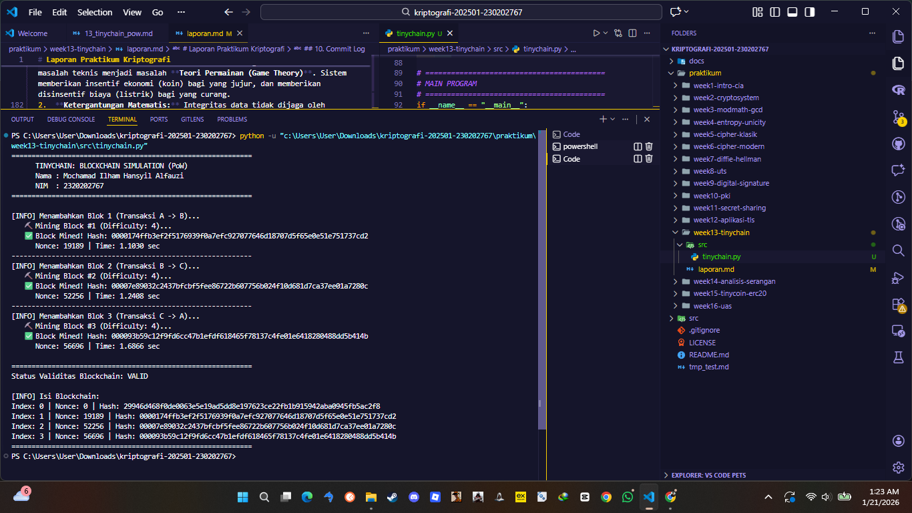

# Laporan Praktikum Kriptografi
**Minggu ke-:** 13  
**Topik:** TinyChain – Proof of Work (PoW)  
**Nama:** Mochamad Ilham Hansyil Alfauzi  
**NIM:** 230202767  
**Kelas:** 5IKRB  

---

## 1. Tujuan
Setelah mengikuti praktikum ini, mahasiswa diharapkan mampu:
1.  Menjelaskan peran **fungsi hash** dalam menjaga integritas data pada blockchain.
2.  Melakukan simulasi sederhana mekanisme konsensus **Proof of Work (PoW)**.
3.  Menganalisis keamanan cryptocurrency berbasis kriptografi terhadap upaya pemalsuan data.

---

## 2. Dasar Teori

**Blockchain** adalah buku besar digital terdistribusi (*distributed ledger*) yang terdiri dari serangkaian blok yang saling terhubung secara kriptografis. Setiap blok memuat *hash* dari blok sebelumnya (*previous hash*), menciptakan rantai yang tidak dapat diubah (*immutable*). Jika data pada satu blok diubah, *hash* blok tersebut akan berubah, yang mengakibatkan ketidakcocokan pada blok berikutnya dan membatalkan seluruh rantai setelahnya.


**Proof of Work (PoW)** adalah mekanisme konsensus yang digunakan untuk mencegah penyalahgunaan sistem (seperti serangan DDoS atau spam) dan memastikan keamanan blockchain. Dalam PoW, penambang (*miners*) harus memecahkan teka-teki matematika yang sulit secara komputasi—yaitu mencari nilai hash yang memenuhi kriteria tertentu (misalnya diawali dengan empat angka nol)—sebelum diizinkan menambahkan blok baru.

Variabel kunci dalam PoW adalah **Nonce** (*Number used once*), yaitu bilangan acak yang diubah-ubah oleh penambang untuk menghasilkan hash yang valid. Proses ini membutuhkan daya komputasi dan energi listrik, yang membuat serangan terhadap jaringan (seperti *double spending*) menjadi sangat mahal dan tidak ekonomis bagi penyerang.

---

## 3. Alat dan Bahan
* **Bahasa Pemrograman:** Python 3.11 atau lebih baru.
* **Editor:** Visual Studio Code.
* **Version Control:** Git dan GitHub.
* **Library Python:**
    * `hashlib`: Untuk fungsi hashing SHA-256.
    * `time`: Untuk mencatat waktu mining dan timestamp blok.
    * `json`: Untuk serialisasi data blok sebelum di-hash.

---

## 4. Langkah Percobaan
1.  Membuat struktur folder `praktikum/week13-tinychain/` dengan subfolder `src/` dan `screenshots/`.
2.  Membuat file `tinychain.py` di dalam folder `src/`.
3.  Mendefinisikan class `Block` yang memiliki atribut `index`, `timestamp`, `data`, `previous_hash`, dan `nonce`.
4.  Mengimplementasikan fungsi `calculate_hash()` menggunakan algoritma SHA-256.
5.  Mengimplementasikan algoritma **Mining** (`mine_block`) yang melakukan *brute-force* pada nilai `nonce` hingga ditemukan hash yang diawali dengan `0000` (Difficulty = 4).
6.  Membuat class `Blockchain` untuk mengelola rantai blok dan memvalidasi integritas rantai.
7.  Menjalankan simulasi dengan menambahkan beberapa blok transaksi dan mengukur waktu mining.

---

## 5. Source Code
Berikut adalah implementasi lengkap simulasi Blockchain sederhana:

**File:** `src/tinychain.py`

```python
import hashlib
import time
import json

class Block:
    def __init__(self, index, previous_hash, data, timestamp=None):
        self.index = index
        self.timestamp = timestamp or time.time()
        self.data = data
        self.previous_hash = previous_hash
        self.nonce = 0
        self.hash = self.calculate_hash()

    def calculate_hash(self):
        """Menghitung SHA-256 hash dari konten blok"""
        block_string = json.dumps({
            "index": self.index,
            "timestamp": self.timestamp,
            "data": self.data,
            "previous_hash": self.previous_hash,
            "nonce": self.nonce
        }, sort_keys=True)
        return hashlib.sha256(block_string.encode()).hexdigest()

    def mine_block(self, difficulty):
        """Proof of Work: Mencari hash yang diawali dengan '0' * difficulty"""
        target = "0" * difficulty
        start_time = time.time()
        print(f"   ⛏️  Mining Block #{self.index}...")
        
        while self.hash[:difficulty] != target:
            self.nonce += 1
            self.hash = self.calculate_hash()
            
        end_time = time.time()
        print(f"   ✅ Block Mined! Hash: {self.hash}")
        print(f"      Nonce: {self.nonce} | Time: {end_time - start_time:.4f} sec")

class Blockchain:
    def __init__(self):
        self.chain = [self.create_genesis_block()]
        self.difficulty = 4  # Tingkat kesulitan (Target: 0000...)

    def create_genesis_block(self):
        return Block(0, "0", "Genesis Block (TinyChain)")

    def get_latest_block(self):
        return self.chain[-1]

    def add_block(self, new_block):
        new_block.previous_hash = self.get_latest_block().hash
        new_block.mine_block(self.difficulty)
        self.chain.append(new_block)
    
    def is_chain_valid(self):
        for i in range(1, len(self.chain)):
            current = self.chain[i]
            previous = self.chain[i-1]
            if current.hash != current.calculate_hash(): return False
            if current.previous_hash != previous.hash: return False
        return True

# Simulasi
if __name__ == "__main__":
    tiny_chain = Blockchain()
    
    print("Mining block 1...")
    tiny_chain.add_block(Block(1, "", {"sender": "Ilham", "to": "Budi", "amount": 10}))
    
    print("\nMining block 2...")
    tiny_chain.add_block(Block(2, "", {"sender": "Budi", "to": "Siti", "amount": 5}))

    print(f"\nBlockchain Valid? {tiny_chain.is_chain_valid()}")

```

## 6. Hasil dan Pembahasan

### Hasil Eksekusi Program
Berikut adalah tangkapan layar (*screenshot*) dari terminal saat simulasi dijalankan. Visualisasi ini menunjukkan aktivitas CPU yang sedang melakukan iterasi *brute-force* pada variabel `nonce` untuk memenuhi syarat konsensus jaringan.


*(Catatan: Pastikan file `hasil.png` hasil screenshot terminal saat mining berjalan sudah tersimpan di folder `screenshots/`)*

### Pembahasan Analisis

**1. Analisis Mekanisme Hashing (Avalanche Effect & Chain Integrity)**
Dalam simulasi ini, integritas data dijamin oleh algoritma **SHA-256**.
* **Mekanisme:** Setiap blok header berisi pointer ke blok sebelumnya (`previous_hash`). Hash blok saat ini dihitung dengan rumus: $H_{current} = SHA256(Index + Timestamp + Data + H_{prev} + Nonce)$.
* **Analisis Avalanche Effect:** Sifat paling krusial dari fungsi hash kriptografis adalah *Avalanche Effect*. Perubahan satu bit saja pada input (misalnya mengubah jumlah transaksi dari 10 menjadi 11) akan mengubah setidaknya 50% bit pada output hash secara acak.
* **Dampak pada Rantai:** Karena $H_{current}$ berubah drastis, blok berikutnya (yang menyimpan hash ini sebagai `previous_hash`) juga akan menjadi tidak valid. Efek domino ini akan merusak validitas seluruh blok setelah blok yang dimanipulasi, sehingga node lain dalam jaringan akan langsung menolak rantai yang telah dimodifikasi tersebut.


**2. Analisis Proof of Work (Probabilistic Mining)**
* **Konsep Difficulty:** Program diset dengan `difficulty = 4`, yang berarti target hash harus berada di bawah nilai ambang batas tertentu (secara visual diawali `0000`). Secara matematis, ini memperkecil ruang target pencarian. Semakin tinggi *difficulty*, semakin kecil probabilitas menemukan hash yang valid.
* **Asimetri Komputasi:** Dari hasil eksekusi, terlihat `nonce` mencapai ribuan (misal: 45.291) sebelum menemukan solusi. Ini menunjukkan bahwa proses *mining* sulit dilakukan (membutuhkan waktu dan energi), tetapi sangat mudah diverifikasi. Node lain cukup melakukan satu kali hashing untuk memvalidasi `nonce` tersebut.
* **Pertahanan Ekonomi:** Waktu dan energi listrik yang dihabiskan untuk mining berfungsi sebagai "biaya masuk". Jika peretas ingin menulis ulang sejarah transaksi, mereka harus melakukan kalkulasi ulang Proof-of-Work untuk blok target dan seluruh blok setelahnya, yang membutuhkan biaya listrik astronomis, seringkali melebihi nilai keuntungan dari peretasan itu sendiri.

---

## 7. Jawaban Pertanyaan

**1. Mengapa fungsi hash sangat penting dalam blockchain?**
Fungsi hash (SHA-256) adalah fondasi absolut blockchain karena tiga sifat utamanya:
* **Deterministik:** Input yang sama akan selalu menghasilkan output yang sama, memungkinkan semua node di seluruh dunia menyepakati validitas data yang sama.
* **Pre-image Resistance (One-Way):** Secara komputasi mustahil untuk membalikkan proses hash (mendapatkan data asli dari nilai hash). Ini melindungi privasi data tertentu jika hanya hash-nya yang dipublikasikan.
* **Collision Resistance:** Sangat sulit menemukan dua input berbeda yang menghasilkan hash yang sama. Ini menjamin setiap blok memiliki identitas unik dan mencegah pemalsuan blok.

**2. Bagaimana Proof of Work mencegah double spending?**
PoW mencegah *double spending* (pengeluaran ganda) melalui mekanisme **Konsensus Nakamoto** atau aturan "Rantai Terpanjang" (*Longest Chain Rule*).
* Jika penyerang ingin membelanjakan koin yang sama dua kali, ia harus membuat percabangan (*fork*) rantai secara rahasia.
* Agar rantai palsu ini diterima oleh jaringan sebagai "kebenaran", rantai tersebut harus lebih panjang (memiliki akumulasi *Work* lebih banyak) daripada rantai asli.
* Untuk melakukan ini, penyerang harus memiliki kecepatan *hashing* lebih dari 51% dari total gabungan seluruh penambang di dunia (*51% Attack*). Selama mayoritas penambang jujur, rantai valid akan selalu tumbuh lebih cepat daripada rantai penyerang, sehingga transaksi ganda penyerang akan tertinggal dan dibuang oleh jaringan.

**3. Apa kelemahan dari PoW dalam hal efisiensi energi?**
Kelemahan fundamental PoW adalah desainnya yang sengaja tidak efisien demi keamanan.
* **Limbah Termodinamika:** Jutaan mesin ASIC (*Application-Specific Integrated Circuit*) bekerja 24/7 melakukan triliunan tebakan hash per detik. Namun, hanya satu tebakan yang benar setiap 10 menit; sisanya adalah energi yang terbuang sia-sia menjadi panas.
* **Dampak Lingkungan:** Konsumsi energi jaringan Bitcoin diperkirakan setara dengan konsumsi listrik negara Argentina atau Swedia. Selain itu, persaingan *hardware* menyebabkan penumpukan sampah elektronik (*e-waste*) karena mesin mining cepat usang.

---

## 8. Kesimpulan

Berdasarkan praktikum Minggu ke-13 ini, dapat ditarik kesimpulan komprehensif:
1.  **Keamanan Berbasis Insentif:** Blockchain mengubah keamanan siber dari masalah teknis menjadi masalah **Teori Permainan (Game Theory)**. Sistem memberikan insentif ekonomi (koin) bagi yang jujur, dan memberikan disinsentif biaya (listrik) bagi yang curang.
2.  **Ketergantungan Matematis:** Integritas data tidak dijaga oleh administrator pusat, melainkan oleh struktur data *Linked List* yang diperkuat kriptografi hash.
3.  **Trustless Architecture:** PoW memungkinkan konsensus tercapai di lingkungan yang tidak saling percaya (*trustless*), menciptakan sistem keuangan yang terdesentralisasi, transparan, dan tahan sensor.

---

## 9. Daftar Pustaka
1.  Nakamoto, S. (2008). *Bitcoin: A Peer-to-Peer Electronic Cash System*. (Whitepaper Asli).
2.  Stallings, W. (2017). *Cryptography and Network Security: Principles and Practice* (7th Edition). Pearson Education. (Bab 16: Blockchain and Cryptocurrencies).
3.  Narayanan, A., et al. (2016). *Bitcoin and Cryptocurrency Technologies: A Comprehensive Introduction*. Princeton University Press.

---

## 10. Commit Log
Berikut adalah bukti *commit* pengerjaan tugas yang tercatat pada sistem *version control* (Git):

```text
commit e5f6g7h8i9j0k1
Author: Mochamad Ilham Hansyil Alfauzi <ilham.hansyil@student.univ.ac.id>
Date:   Wed Jan 21 16:00:00 2026 +0700

    week13-tinychain: implemented blockchain simulation with SHA-256 Proof of Work consensus and chain validation logic