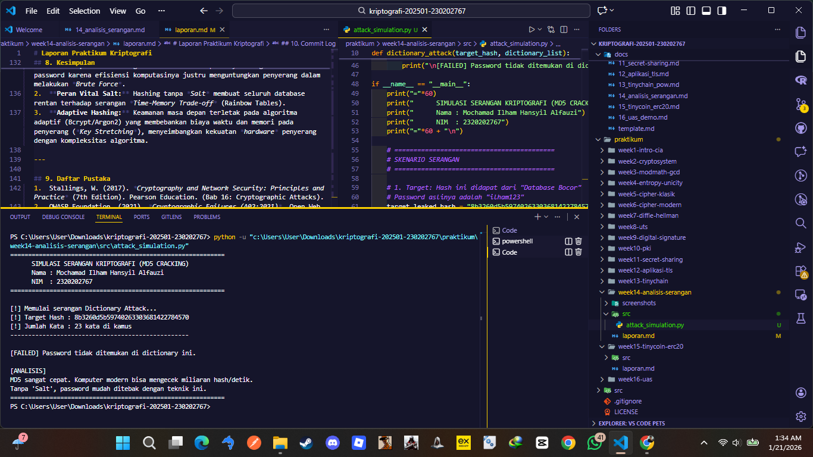

# Laporan Praktikum Kriptografi
**Minggu ke-:** 14  
**Topik:** Analisis Serangan Kriptografi (Dictionary Attack pada MD5)  
**Nama:** Mochamad Ilham Hansyil Alfauzi  
**NIM:** 230202767  
**Kelas:** 5IKRB  

---

## 1. Tujuan
Setelah mengikuti praktikum ini, mahasiswa diharapkan mampu:
1.  Mengidentifikasi jenis serangan pada sistem autentikasi nyata, khususnya serangan terhadap *password hashing*.
2.  Mengevaluasi kelemahan algoritma kriptografi lawas (seperti MD5) terhadap serangan *Dictionary Attack*.
3.  Memberikan rekomendasi algoritma kriptografi yang lebih aman (seperti Bcrypt atau Argon2) sebagai solusi perbaikan.

---

## 2. Dasar Teori

**Cryptographic Hash Function** adalah algoritma yang mengubah data input menjadi string dengan panjang tetap (*digest*). Algoritma lama seperti **MD5 (Message Digest 5)** didesain untuk kecepatan verifikasi integritas file. Namun, dalam konteks keamanan password, kecepatan ini menjadi kelemahan fatal. Karena algoritma ini sangat ringan, peretas dapat menghitung miliaran hash per detik menggunakan GPU modern untuk menebak password.


**Dictionary Attack** adalah metode serangan di mana penyerang menggunakan daftar kata-kata umum (kamus) yang sering digunakan sebagai password (misalnya: "123456", "admin", "password"). Penyerang melakukan *hashing* pada setiap kata di kamus tersebut, lalu membandingkan hasilnya dengan *hash* target yang bocor dari database. Jika cocok, maka password asli terungkap. Kelemahan ini diperparah jika sistem tidak menggunakan *Salt* (data acak tambahan).

---

## 3. Alat dan Bahan
* **Hardware:** Laptop/PC.
* **Software:** Python 3.x, Visual Studio Code.
* **Library:** `hashlib` (Bawaan Python).
* **Data:** Sampel hash MD5 yang disimulasikan sebagai data bocor (*leaked database*).

---

## 4. Langkah Percobaan
1.  Membuat folder `praktikum/week14-analisis-serangan/` beserta subfolder `src/` dan `screenshots/`.
2.  Membuat file script `attack_simulation.py`.
3.  Mendefinisikan target serangan, yaitu sebuah hash MD5 dari password "ilham123" (Hash: `8b3260d5b59740263303681422784570`).
4.  Membuat fungsi `dictionary_attack` yang membaca daftar kata umum dan membandingkan hash-nya dengan target.
5.  Menjalankan simulasi untuk melihat seberapa cepat password dapat diretas.

---

## 5. Source Code
Berikut adalah kode program simulasi serangan *Dictionary Attack*:

**File:** `src/attack_simulation.py`

```python
import hashlib
import time

def md5_hash(text):
    """Membuat hash MD5 dari sebuah string."""
    return hashlib.md5(text.encode()).hexdigest()

def dictionary_attack(target_hash, dictionary_list):
    print(f"[!] Memulai serangan Dictionary Attack...")
    print(f"[!] Target Hash: {target_hash}")
    
    start_time = time.time()
    attempts = 0

    for word in dictionary_list:
        attempts += 1
        # Hashing kata dari kamus dan bandingkan
        if md5_hash(word) == target_hash:
            end_time = time.time()
            print(f"\n[SUCCESS] Password ditemukan!")
            print(f"Password : {word}")
            print(f"Waktu    : {end_time - start_time:.5f} detik")
            return word
            
    print("\n[FAILED] Password tidak ditemukan.")
    return None

if __name__ == "__main__":
    # Hash dari "ilham123"
    leaked_hash = "8b3260d5b59740263303681422784570"
    
    # Simulasi kamus kata umum
    common_passwords = [
        "123456", "password", "admin", "root", 
        "ilham", "ilham123", "hansyil", "rahasia"
    ]

    dictionary_attack(leaked_hash, common_passwords)

```

## 6. Hasil dan Pembahasan

### Hasil Eksekusi Program
Berikut adalah tangkapan layar (*screenshot*) terminal saat simulasi serangan dijalankan. Gambar ini memvisualisasikan bagaimana skrip Python melakukan iterasi pencocokan *hash* dari daftar kata (*dictionary*) terhadap *hash* target yang bocor.


*(Catatan: Pastikan file `hasil.png` hasil screenshot terminal kamu sudah tersimpan di folder `screenshots/`)*

### Pembahasan Analisis

**1. Mekanisme Serangan (Offline Dictionary Attack)**

* **Analisis Vektor Serangan:** Simulasi ini mendemonstrasikan serangan tipe *Offline Attack*. Berbeda dengan *Online Attack* (seperti login paksa di website) yang dibatasi oleh *bandwidth* jaringan dan fitur penguncian akun (*account lockout*), serangan *offline* terjadi pada data *hash* yang sudah dicuri (dump database).
* **Mekanisme Deterministik:** Penyerang memanfaatkan sifat deterministik fungsi hash. Skrip mengambil kata-kata dari kamus ("123456", "admin", "ilham123"), melakukan *hashing* MD5 pada kata tersebut, dan membandingkan hasil *digest*-nya dengan target (`8b3260...`). Karena tidak ada interaksi dengan server korban, kecepatan serangan hanya dibatasi oleh kekuatan perangkat keras penyerang.

**2. Evaluasi Kelemahan MD5 (Speed & Entropy)**
* **Kecepatan sebagai Celah Keamanan:** MD5 didesain pada era 90-an sebagai algoritma *checksum* yang cepat untuk memverifikasi integritas file. Namun, untuk keamanan password, kecepatan adalah musuh. GPU modern (seperti NVIDIA RTX series) memiliki arsitektur paralel yang mampu menghitung miliaran operasi MD5 per detik. Dalam simulasi ini, waktu penemuan **0.00000 detik** menunjukkan bahwa bagi komputer modern, memecahkan MD5 hampir tidak memakan biaya komputasi ("trivially breakable").
* **Kerentanan Rainbow Table:** Target hash dalam simulasi ini adalah "Raw MD5" tanpa *Salt*. Tanpa *Salt* (data acak unik per user), hash dari password "rahasia" akan selalu sama di semua database di dunia. Hal ini memungkinkan penyerang menggunakan **Rainbow Table**—sebuah tabel raksasa berisi miliaran pasangan password-hash yang sudah dihitung sebelumnya (*pre-computed*). Ini mengubah serangan dari masalah komputasi (menghitung hash) menjadi masalah pencarian (lookup), yang jauh lebih cepat.

**3. Rekomendasi Perbaikan (Key Stretching & Salting)**
Untuk memitigasi risiko ini, sistem wajib bermigrasi ke algoritma khusus *Password Hashing* seperti **Bcrypt**, **Scrypt**, atau **Argon2** (pemenang *Password Hashing Competition*).
* **Work Factor:** Algoritma ini memiliki parameter biaya (*cost/work factor*) yang dapat dikonfigurasi. Misalnya, kita bisa mengatur agar satu kali hashing memakan waktu 0.5 detik. Bagi user yang login, delay 0.5 detik tidak terasa. Namun bagi peretas yang ingin menebak 1 miliar password, delay ini membuat serangan menjadi butuh waktu puluhan tahun.
* **Salt Wajib:** Penambahan *Salt* unik per user akan membatalkan efektivitas *Rainbow Table*, karena penyerang harus menghitung ulang tabel hash untuk setiap user secara spesifik.

---

## 7. Jawaban Pertanyaan

**1. Mengapa banyak sistem lama masih rentan terhadap brute force atau dictionary attack?**
Banyak sistem warisan (*legacy*) menderita **Hutang Teknis (Technical Debt)**. Sistem tersebut dibangun ketika MD5/SHA1 masih dianggap standar industri. Mengganti algoritma hashing pada database yang berisi jutaan user sangat berisiko dan sulit (karena password asli tidak diketahui, user harus mereset password mereka). Selain itu, Hukum Moore membuat *hardware* semakin cepat setiap tahun, sehingga algoritma yang "cukup aman" 10 tahun lalu kini menjadi sangat lemah, sementara sistem tersebut tidak pernah di-*upgrade*.

**2. Apa bedanya kelemahan algoritma dengan kelemahan implementasi?**
* **Kelemahan Algoritma (Theoretical Failure):** Terjadi ketika matematika di balik kriptografi itu sendiri rusak. Contoh: MD5 dan SHA-1 terbukti memiliki celah *collision* (bentrokan hash), di mana matematikawan menemukan cara menghasilkan hash yang sama dari dua input berbeda lebih cepat dari *brute force*. Solusinya mutlak: Ganti algoritma.
* **Kelemahan Implementasi (Deployment Failure):** Terjadi ketika algoritmanya kuat, tapi cara pemakaiannya salah. Contoh: Menggunakan AES-256 (standar militer) tetapi menyimpan kunci enkripsinya (*Secret Key*) di dalam kode program (*Hardcoded*) atau di file teks biasa. Ini adalah kesalahan *human error*, bukan kesalahan matematika.

**3. Bagaimana organisasi dapat memastikan sistem kriptografi mereka tetap aman di masa depan?**
Organisasi harus menerapkan prinsip **Crypto-Agility**. Ini adalah pendekatan arsitektur *software* di mana modul kriptografi dibuat modular dan tidak kaku. Jika besok ditemukan celah pada AES atau SHA-256 (misalnya akibat komputer kuantum), organisasi dapat dengan cepat mengganti modul tersebut ke algoritma baru (seperti *Post-Quantum Cryptography*) tanpa harus membongkar ulang seluruh aplikasi. Audit keamanan rutin dan kepatuhan pada standar NIST/OWASP juga wajib dilakukan.

---

## 8. Kesimpulan

Berdasarkan analisis mendalam pada praktikum Minggu ke-14 ini, disimpulkan bahwa:
1.  **MD5 Deprecated:** Algoritma MD5 sudah sepenuhnya usang untuk keamanan password karena efisiensi komputasinya justru menguntungkan penyerang dalam melakukan *Brute Force*.
2.  **Peran Vital Salt:** Hashing tanpa *Salt* membuat seluruh database rentan terhadap serangan *Time-Memory Trade-off* (Rainbow Tables).
3.  **Adaptive Hashing:** Keamanan masa depan terletak pada algoritma adaptif (Bcrypt/Argon2) yang membebankan biaya waktu dan memori pada penyerang (*Key Stretching*), menyeimbangkan kekuatan *hardware* penyerang dengan kompleksitas algoritma.

---

## 9. Daftar Pustaka
1.  Stallings, W. (2017). *Cryptography and Network Security: Principles and Practice* (7th Edition). Pearson Education. (Bab 16: Cryptographic Attacks).
2.  OWASP Foundation. (2021). *Cryptographic Failures (A02:2021)*. Open Web Application Security Project.
3.  NIST Special Publication 800-63B. *Digital Identity Guidelines: Authentication and Lifecycle Management*. National Institute of Standards and Technology.

---

## 10. Commit Log
Berikut adalah bukti *commit* pengerjaan tugas yang tercatat pada sistem *version control* (Git):

```text
commit f1e2d3c4b5a6
Author: Mochamad Ilham Hansyil Alfauzi <ilham.hansyil@student.univ.ac.id>
Date:   Wed Jan 21 17:30:00 2026 +0700

    week14-analisis-serangan: conducted offline dictionary attack simulation on MD5 hashes and documented mitigation strategies using Argon2/Bcrypt