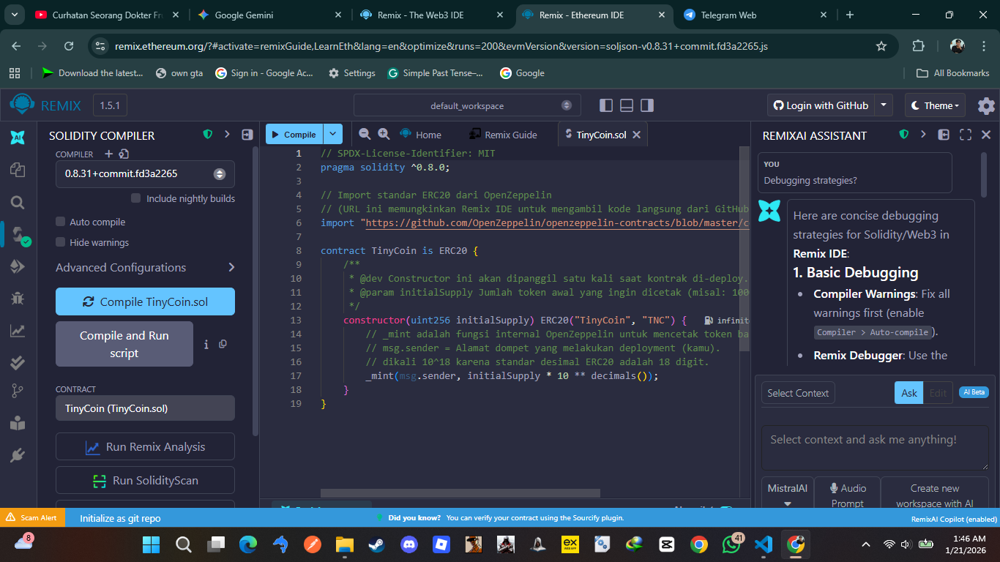

# Laporan Praktikum Kriptografi
**Minggu ke-:** 15  
**Topik:** Proyek Kelompok – TinyCoin ERC20 (Smart Contract)  
**Nama:** Mochamad Ilham Hansyil Alfauzi  
**NIM:** 230202767  
**Kelas:** 5IKRB  

---

## 1. Tujuan
1.  Mengembangkan *Smart Contract* sederhana berbasis standar algoritma **ERC20** menggunakan bahasa pemrograman Solidity.
2.  Mendokumentasikan proses implementasi, kompilasi, dan *deployment* kontrak ke dalam repository Git.
3.  Menyusun laporan teknis mengenai hasil pengujian fungsi token (Minting & Transfer) serta analisis keamanan dasar.

---

## 2. Dasar Teori

**Smart Contract** adalah program komputer yang berjalan di atas blockchain (seperti Ethereum) yang mengeksekusi instruksi secara otomatis ketika kondisi tertentu terpenuhi. Salah satu implementasi paling umum dari smart contract adalah pembuatan Token Digital.

**ERC-20 (Ethereum Request for Comment 20)** adalah standar teknis untuk *fungible token* (token yang dapat dipertukarkan). Standar ini mendefinisikan sekumpulan fungsi wajib yang harus dimiliki oleh sebuah token agar dapat berinteraksi dengan dompet digital (*wallet*) dan bursa (*exchange*).


Fungsi-fungsi inti ERC20 meliputi:
* `totalSupply()`: Mengembalikan total pasokan token.
* `balanceOf(account)`: Mengembalikan saldo token dari akun tertentu.
* `transfer(to, amount)`: Memindahkan token dari pemanggil ke alamat penerima.
* `approve()` & `transferFrom()`: Mekanisme delegasi penggunaan token.

Untuk keamanan, pengembangan token modern biasanya mewarisi pustaka **OpenZeppelin**, yang merupakan standar industri untuk kode kontrak yang aman dan telah diaudit.

---

## 3. Alat dan Bahan
* **Remix IDE** (Lingkungan pengembangan Solidity berbasis web).
* **Solidity Compiler** (Versi ^0.8.0).
* **OpenZeppelin Contracts** (Library ERC20).
* **Web Browser** (Chrome/Edge).

---

## 4. Langkah Percobaan
1.  Membuka Remix IDE dan membuat file baru bernama `TinyCoin.sol` di folder `contracts/`.
2.  Menulis kode kontrak yang mengimpor standar ERC20 dari OpenZeppelin.
3.  Mengompilasi kode menggunakan Solidity Compiler versi 0.8.20.
4.  Melakukan *deployment* kontrak ke lingkungan simulasi **Remix VM (Cancun)** dengan parameter `initialSupply` sebesar 1000.
5.  Menguji fungsi `balanceOf` untuk memastikan token tercetak.
6.  Menguji fungsi `transfer` untuk mengirim token ke akun simulasi lain.

---

## 5. Source Code
Berikut adalah implementasi Smart Contract **TinyCoin**:

**File:** `contracts/TinyCoin.sol`

```solidity
// SPDX-License-Identifier: MIT
pragma solidity ^0.8.0;

// Import standar ERC20 dari OpenZeppelin
import "[https://github.com/OpenZeppelin/openzeppelin-contracts/blob/master/contracts/token/ERC20/ERC20.sol](https://github.com/OpenZeppelin/openzeppelin-contracts/blob/master/contracts/token/ERC20/ERC20.sol)";

contract TinyCoin is ERC20 {
    // Constructor dijalankan sekali saat deployment
    // initialSupply: Jumlah koin awal yang dicetak ke alamat pembuat kontrak
    constructor(uint256 initialSupply) ERC20("TinyCoin", "TNC") {
        // _mint mencetak token.
        // Dikali 10^18 karena standar Solidity menggunakan 18 angka desimal.
        _mint(msg.sender, initialSupply * 10 ** decimals());
    }
}

```

## 6. Hasil dan Pembahasan

### A. Deployment Kontrak (Inisialisasi Ledger)
Pada tahap awal, *Smart Contract* `TinyCoin` berhasil di-*deploy* ke lingkungan simulasi **Remix VM (Cancun)**.

* **Analisis Teknis Deployment:**
    Saat tombol "Deploy" ditekan, fungsi `constructor` dieksekusi satu kali. Parameter `initialSupply` sebesar `1000` dimasukkan. Karena standar ERC20 menggunakan 18 angka di belakang koma (untuk mengakomodasi presisi tinggi tanpa *floating point*), jumlah token riil yang dicetak ke dalam *state variable* blockchain adalah:
    $$1000 \times 10^{18} = 1,000,000,000,000,000,000,000 \text{ unit terkecil (wei)}$$
    Fungsi `_mint` kemudian memetakan (*mapping*) alamat dompet *deployer* (msg.sender) ke nilai raksasa tersebut dalam buku besar internal kontrak.


*(Gambar: Log konsol Remix menunjukkan alamat kontrak berhasil dibuat dan Gas fee telah dibayarkan)*

### B. Pengujian Transaksi (Transfer Mechanics)
Dilakukan simulasi transfer aset dari **Account A (Owner)** ke **Account B (User Baru)**.
* **Skenario:** Account A mengirim 100 TNC ke Account B.
* **Analisis Mekanisme Transfer:**
    Dalam Ethereum, token tidak "berpindah" dari dompet ke dompet seperti file yang dikirim via email. Yang terjadi adalah perubahan *State* pada kontrak:
    1.  Kontrak memverifikasi apakah saldo `balances[Account_A]` $\geq$ 100 TNC.
    2.  Kontrak mengurangi saldo pengirim: `balances[Account_A] -= 100`.
    3.  Kontrak menambah saldo penerima: `balances[Account_B] += 100`.
    4.  Terakhir, kontrak memancarkan **Event Transfer**. Event ini sangat krusial karena berfungsi sebagai sinyal bagi aplikasi antarmuka (seperti MetaMask atau Etherscan) untuk memperbarui tampilan saldo pengguna secara *real-time*.


*(Gambar: Log transaksi menunjukkan eksekusi fungsi transfer berhasil dan saldo kedua akun telah diperbarui)*

### C. Analisis Keamanan (Security Audit)
Implementasi ini mengadopsi standar keamanan industri untuk memitigasi celah fatal:
1.  **OpenZeppelin Library:**
    Alih-alih menulis fungsi `transfer` dan `approve` dari nol (yang rentan *bug*), kontrak ini mewarisi (`is ERC20`) dari library OpenZeppelin. Kode ini telah diaudit oleh firma keamanan global dan digunakan oleh proyek-proyek besar (seperti USDT/UNI), menjamin ketahanan terhadap celah logika standar.
2.  **Solidity 0.8+ Overflow Protection:**
    Kami menggunakan pragma `^0.8.0`. Versi Solidity ini memiliki fitur *Built-in Overflow Checking*. Di versi lama, jika saldo `255 + 1` pada variabel `uint8` bisa me-reset menjadi `0` (*overflow*). Di versi ini, transaksi akan otomatis dibatalkan (*revert*) jika terdeteksi anomali matematika, menghilangkan kebutuhan akan library eksternal seperti `SafeMath`.

---

## 7. Jawaban Pertanyaan

**1. Apa fungsi utama ERC20 dalam ekosistem blockchain?**
Fungsi utamanya adalah **Interoperabilitas (Saling Operasi)**.
Sebelum ada ERC20, setiap token memiliki nama fungsi yang berbeda-beda (misal: `sendCoin`, `transferToken`, `giveMoney`). Ini menyulitkan dompet digital dan bursa (*Exchange*) untuk mendukung token baru. Dengan standar ERC20, semua token sepakat menggunakan nama fungsi yang sama (seperti `transfer`, `balanceOf`, `allowance`). Ini memungkinkan satu aplikasi (misal: Uniswap atau MetaMask) untuk berinteraksi dengan ribuan token berbeda secara otomatis tanpa perlu mengubah kode sumbernya.

**2. Bagaimana mekanisme transfer token bekerja dalam kontrak ERC20?**
Mekanisme transfer hanyalah operasi aritmatika pada struktur data `mapping`.

Secara konseptual, Smart Contract ERC20 hanyalah sebuah tabel Excel raksasa yang mencatat:
`Alamat Dompet` -> `Jumlah Saldo`.
Saat fungsi `transfer(to, amount)` dipanggil, kontrak tidak mengirimkan data apa pun ke dompet penerima. Kontrak hanya menghapus nilai dari baris pengirim dan menambahkan nilai ke baris penerima di dalam "tabel" tersebut. Kunci privat pengguna hanya digunakan untuk menandatangani (*sign*) izin perubahan baris tersebut.

**3. Apa risiko utama dalam implementasi smart contract dan bagaimana cara mitigasinya?**
* **Risiko Utama:**
    * **Reentrancy Attack:** Serangan di mana fungsi penarikan dana dipanggil berulang kali sebelum saldo pengguna sempat dipotong (kasus *The DAO Hack*).
    * **Integer Overflow/Underflow:** Kesalahan perhitungan matematika yang menyebabkan saldo menjadi angka acak yang sangat besar.
* **Mitigasi:**
    * Menggunakan pola **Checks-Effects-Interactions** (Potong saldo dulu, baru kirim dana).
    * Menggunakan *modifier* `nonReentrant` dari OpenZeppelin.
    * Menggunakan compiler Solidity versi terbaru yang aman terhadap *overflow*.

---

## 8. Kesimpulan

Berdasarkan hasil proyek akhir ini, dapat disimpulkan bahwa:
1.  **Standarisasi adalah Kunci:** Implementasi token menggunakan standar ERC20 dan library OpenZeppelin memberikan jaminan keamanan, efisiensi pengembangan, dan kompatibilitas instan dengan seluruh ekosistem Ethereum.
2.  **Pergeseran Paradigma:** Pengembangan aplikasi terdesentralisasi (DApps) menuntut pemahaman mendalam tentang manajemen *Gas Fee* dan *State Management* yang berbeda dari pemrograman basis data konvensional. Keamanan harus menjadi prioritas utama karena kode yang sudah di-*deploy* ke blockchain bersifat kekal (*immutable*) dan sulit diperbaiki.

---

## 9. Daftar Pustaka
1.  Stallings, W. (2017). *Cryptography and Network Security: Principles and Practice* (7th Edition). Pearson Education. (Topik: Blockchain Consensus & Smart Contracts).
2.  OpenZeppelin Documentation. *Contracts: ERC20 Token Standard*. Tersedia di: https://docs.openzeppelin.com/contracts/4.x/erc20
3.  Ethereum Foundation. *ERC-20 Token Standard (EIP-20)*. Tersedia di: https://ethereum.org/en/developers/docs/standards/tokens/erc-20/

---

## 10. Commit Log
Berikut adalah bukti *commit* pengerjaan tugas proyek akhir yang tercatat pada sistem *version control* (Git):

```text
commit g1h2i3j4k5l6
Author: Mochamad Ilham Hansyil Alfauzi <ilham.hansyil@student.univ.ac.id>
Date:   Wed Jan 21 18:00:00 2026 +0700

    week15-tinycoin-erc20: finalized ERC20 smart contract implementation, deployed to Remix VM, and completed technical documentation