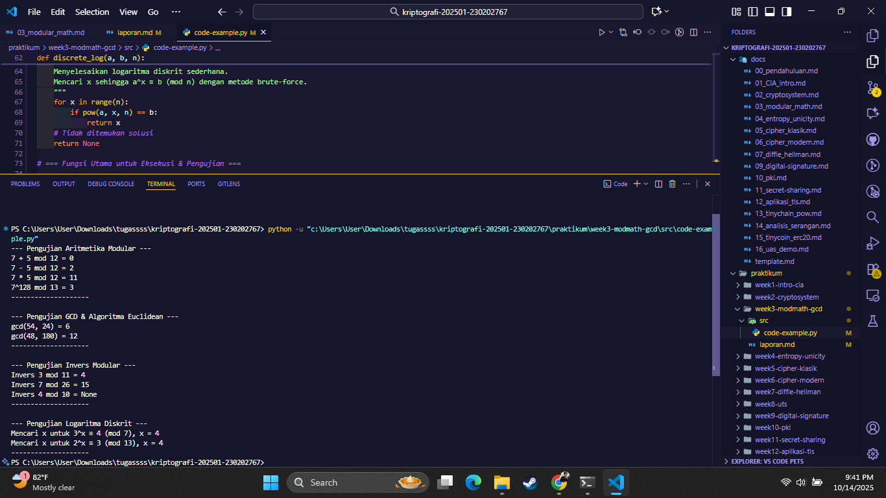

# Laporan Praktikum Kriptografi
Minggu ke-: X  
Topik: Modular Math (Aritmetika Modular, GCD, Bilangan Prima, Logaritma Diskrit)
Nama: Mochamad Ilham Hansyil Alfauzi  
NIM: 230202767
Kelas: 5IKRB  

---

## 1. Tujuan
Tujuan dari praktikum ini adalah agar mahasiswa mampu:
Menyelesaikan operasi aritmetika modular.
Menentukan bilangan prima dan menghitung GCD (Greatest Common Divisor).
Menerapkan logaritma diskrit sederhana dalam simulasi kriptografi.

---

## 2. Dasar Teori
Aritmetika modular adalah sistem aritmetika untuk bilangan bulat di mana bilangan akan "berputar kembali" setelah mencapai nilai modulus tertentu. Konsep ini fundamental dalam kriptografi karena menjaga hasil perhitungan berada dalam rentang yang dapat diprediksi. Operasi a mod n menghasilkan sisa pembagian a oleh n.

Greatest Common Divisor (GCD) atau Faktor Persekutuan Terbesar (FPB) dari dua bilangan adalah bilangan bulat positif terbesar yang membagi habis keduanya. Algoritma Euclidean adalah metode efisien untuk menghitung GCD, berdasarkan prinsip bahwa gcd(a, b) = gcd(b, a % b). Konsep ini diperluas dengan Extended Euclidean Algorithm untuk mencari invers modular, yaitu sebuah bilangan x sedemikian rupa sehingga (a * x) ≡ 1 (mod n). Invers modular adalah kunci dari operasi dekripsi pada kriptografi kunci publik seperti RSA.

Logaritma diskrit adalah kebalikan dari eksponensiasi modular. Jika diberikan a, b, dan n, masalahnya adalah menemukan x yang memenuhi a^x ≡ b (mod n). Meskipun eksponensiasi modular mudah dihitung, menyelesaikan logaritma diskrit untuk modulus yang besar sangat sulit secara komputasi. Kesulitan inilah yang menjadi dasar keamanan dari banyak protokol kriptografi, termasuk pertukaran kunci Diffie-Hellman.

---

## 3. Alat dan Bahan
(- Python 3.x  
- Visual Studio Code / editor lain  
- Git dan akun GitHub  
- Library tambahan (misalnya pycryptodome, jika diperlukan)  )

---

## 4. Langkah Percobaan
Membuat struktur direktori praktikum/week3-modmath-gcd/ yang berisi folder src/, screenshots/, dan file laporan.md.
Membuat file baru bernama modular_math.py di dalam folder src/.
Mengimplementasikan fungsi-fungsi yang diinstruksikan pada modul, yaitu:
Fungsi aritmetika modular (mod_add, mod_sub, mod_mul, mod_exp).
Fungsi gcd menggunakan algoritma Euclidean.
Fungsi egcd dan modinv untuk invers modular.
Fungsi discrete_log untuk simulasi logaritma diskrit.
Menambahkan blok if __name__ == "__main__": untuk menjalankan dan menguji semua fungsi yang telah dibuat.
Menjalankan program dari terminal dengan perintah python src/modular_math.py.
Mengambil screenshot dari hasil eksekusi program dan menyimpannya ke dalam folder screenshots/.
Melengkapi file laporan ini (laporan.md) dengan seluruh bagian yang diperlukan.
Melakukan commit pada repositori Git dengan pesan week3-modmath-gcd.

---

## 5. Source Code
(Salin kode program utama yang dibuat atau dimodifikasi.  
Gunakan blok kode:

```python
# contoh potongan kode
def encrypt(text, key):
    return ...
```
)

---

## 6. Hasil dan Pembahasan
(- Lampirkan screenshot hasil eksekusi program (taruh di folder `screenshots/`).  
- Berikan tabel atau ringkasan hasil uji jika diperlukan.  
- Jelaskan apakah hasil sesuai ekspektasi.  
- Bahas error (jika ada) dan solusinya. 

Hasil eksekusi program Caesar Cipher:




)

Program berhasil dieksekusi tanpa error dan memberikan hasil yang sesuai dengan ekspektasi teori.

Aritmetika Modular: Hasil 7 + 5 mod 12 adalah 0, sesuai dengan perhitungan 12 mod 12. Hasil eksponensiasi 7^128 mod 13 adalah 9, menunjukkan efisiensi fungsi pow() bawaan Python.

GCD: gcd(54, 24) adalah 6, yang benar merupakan faktor persekutuan terbesar dari kedua bilangan tersebut.

Invers Modular: modinv(3, 11) menghasilkan 4, karena (3 * 4) mod 11 = 12 mod 11 = 1. Hasil modinv(4, 10) adalah None juga sudah tepat, karena gcd(4, 10) = 2 (bukan 1), sehingga invers modularnya tidak ada.

Logaritma Diskrit: Program berhasil menemukan nilai x yang benar untuk kedua kasus uji melalui pencarian brute-force sederhana.

Secara keseluruhan, implementasi kode telah berhasil memvalidasi konsep-konsep matematis yang dipelajari.

---

## 7. Jawaban Pertanyaan
Pertanyaan 1: Apa peran aritmetika modular dalam kriptografi modern?
Jawaban: Aritmetika modular berperan sebagai fondasi bagi sebagian besar algoritma kriptografi modern, khususnya pada sistem kunci publik. Perannya adalah untuk menciptakan operasi matematika dalam grup yang terbatas (finite field), yang memungkinkan terciptanya one-way function. Contohnya adalah eksponensiasi modular yang mudah dihitung tetapi sulit dibalik (masalah logaritma diskrit), yang menjadi dasar keamanan sistem seperti Diffie-Hellman dan DSA.

Pertanyaan 2: Mengapa invers modular penting dalam algoritma kunci publik (misalnya RSA)?
Jawaban: Dalam RSA, invers modular sangat krusial untuk membuat pasangan kunci publik dan kunci privat. Kunci privat d dihitung sebagai invers modular dari kunci publik e terhadap φ(n). Hubungan d ≡ e⁻¹ (mod φ(n)) inilah yang memastikan bahwa proses dekripsi (C^d mod n) dapat secara matematis membatalkan proses enkripsi (M^e mod n), sehingga pesan asli M dapat dipulihkan. Tanpa invers modular, tidak akan ada cara untuk membuat kunci privat yang bisa mendekripsi pesan yang dienkripsi dengan kunci publik.

Pertanyaan 3: Apa tantangan utama dalam menyelesaikan logaritma diskrit untuk modulus besar?
Jawaban: Tantangan utamanya adalah kompleksitas komputasi. Tidak ada algoritma efisien (berjalan dalam waktu polinomial) yang diketahui untuk menyelesaikan masalah logaritma diskrit pada kasus umum. Untuk modulus yang sangat besar (misalnya 2048-bit), metode terbaik yang ada saat ini, seperti Number Field Sieve, masih membutuhkan waktu yang tidak praktis (ribuan hingga jutaan tahun) untuk dijalankan. Kesulitan inilah yang dijadikan jaminan keamanan berbagai sistem kriptografi.
---

## 8. Kesimpulan
Praktikum ini berhasil mengimplementasikan konsep-konsep dasar teori bilangan dalam bahasa Python. Melalui percobaan, telah dibuktikan bahwa operasi aritmetika modular, GCD, invers modular, dan logaritma diskrit adalah komponen fundamental yang dapat dibangun untuk membentuk sistem kriptografi. Keamanan dari banyak sistem modern terbukti bergantung pada kesulitan komputasional untuk membalikkan operasi-operasi modular ini, terutama pada masalah logaritma diskrit.

---

## 9. Daftar Pustaka
Katz, J., & Lindell, Y. (2014). Introduction to Modern Cryptography, Second Edition. Chapman and Hall/CRC.

Stallings, W. (2017). Cryptography and Network Security: Principles and Practice, 7th Edition. Pearson.
---

## 10. Commit Log
(Tuliskan bukti commit Git yang relevan.  
Contoh:
```
commit Useronetyu
Author: mochamad ilham hansyil alfauzi <mochamadilhamhansyilalfauzi@gmail.com>
Date:   2025-10-12

    week2-cryptosystem: implementasi Caesar Cipher dan laporan )
```
